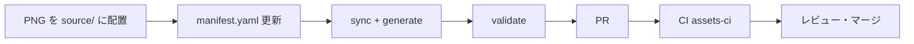

# ゲームアセット入稿フロー

LevelUp Study の **敵・プレイヤー・背景・小物**（バトル同梱）と **マスタ画像**（CDN / `image_url`）の入稿手順です。

---

## 全体像



| 種別 | 正本 | 配布先 | 参照方法 |
|------|------|--------|----------|
| バトルスプライト | `apps/mobile/assets/source/` | Android drawable / iOS imageset | ファイル名ランタイム検出 |
| 敵 slug 対応 | `manifest.yaml` → `EnemySpriteAssets.kt` | KMP shared | `drawableKey(slug)` |
| マスタ立ち絵・武器・バナー | CDN（将来）/ seed `image_url` | ネットワーク | Coil / AsyncImage |

**正本は常に `apps/mobile/assets/`。** Android / iOS 配下への直接編集は sync 実行時に上書きされるため、原則 `source/` 経由で入稿してください。

---

## 1. バトルアセットの入稿（開発者・アーティスト共通）

### 手順

1. **PNG を配置**  
   `apps/mobile/assets/source/` に命名規則どおりのファイル名で置く。  
   詳細な命名は [`apps/mobile/SPRITES_README.md`](../../apps/mobile/SPRITES_README.md) を参照。

2. **manifest を更新**  
   `apps/mobile/assets/manifest.yaml` にエントリを追加。  
   - 背景: `kind: background`, `dungeon_key`  
   - 敵: `enemy_sprite_keys` に key を追加し、`monster_slug_to_sprite_key` で DB slug と対応  
   - 必須アセットは `required: true`

3. **同期・生成・検証**

   ```bash
   ./scripts/assets/run.sh scripts/assets/generate_enemy_sprite_assets.py
   ./scripts/assets/run.sh scripts/assets/sync_battle_assets.py
   ./scripts/assets/run.sh scripts/assets/validate_assets.py
   ```

4. **PR を作成**  
   `feat/{issue番号}-短い説明` ブランチで push したあと、[github-pr-create スキル](.cursor/skills/github-pr-create/SKILL.md) に従い `gh pr create --body-file` で PR を作成します。  
   本文に `Fixes #番号` を記載してください。

### 推奨サイズ

| 種別 | サイズ | 形式 |
|------|--------|------|
| キャラ・敵 | 64–128px | PNG 透過 |
| 背景 | 640×360 以上 | PNG |
| 小物 | 64–128px | PNG 透過 |

---

## 2. マスタ画像（キャラ立ち絵・武器・ダンジョンバナー）

バトル同梱スプライトとは **別系統** です。

| 種別 | DB テーブル | 推奨サイズ | 開発中 | 本番 |
|------|-------------|-----------|--------|------|
| 立ち絵 | `m_characters.image_url` | 512×512 | placehold.co | R2 / Supabase |
| 武器 | `m_weapons.image_url` | 256×256 | placehold.co | CDN |
| ダンジョン | `m_dungeons.image_url` | 800×400 | 空（同梱背景へフォールバック） | CDN |

### 手順（現行）

1. 画像を CDN に配置（本番）または `backend/db/seed.sql` の `image_url` を更新（開発）
2. ダンジョンバナーが空の場合、クライアントは `bg_dungeon_{key}` 同梱画像を使用
3. 敵は `m_monsters.slug` → `EnemySpriteAssets.drawableKey()` で同梱スプライトにフォールバック

将来: `apps/mobile/assets/master/` からアップロードする `upload-master-images.sh` を追加予定。

---

## 3. 機能開発フロー（Issue → ブランチ → PR）

毎回口頭で指示しなくてよいよう、以下を標準とします。

```bash
# GH_TOKEN または GITHUB_TOKEN が必要
./scripts/feature-start.sh \
  --title "feat: 〇〇" \
  --body-file docs/tasks/issue-body-example.md \
  --branch-slug "my-feature"
```

スクリプトは GitHub Issue 作成 → `feat/{番号}-{slug}` ブランチ作成 → `docs/tasks/` に実行計画書の雛形を生成します。

AI 向けの詳細手順は `.cursor/skills/feature-delivery/SKILL.md` を参照。

---

## 4. CI

PR / push 時に `.github/workflows/assets-ci.yml` が以下を実行します。

- `validate_assets.py`
- `generate_enemy_sprite_assets.py --check`
- `sync_battle_assets.py --check`

---

## 5. トラブルシューティング

| 症状 | 対処 |
|------|------|
| validate で Android/iOS 欠落 | `sync_battle_assets.py` を実行 |
| slug 未マッピング | `manifest.yaml` の `monster_slug_to_sprite_key` を追加 → generate |
| 絵文字のまま表示 | `source/` に PNG があるか、sync 済みか確認 |
| zsh で issue 作成失敗 | `--body` はシングルクォート、`--body-file` 推奨 |

---

## 関連ドキュメント

- [`apps/mobile/assets/README.md`](../../apps/mobile/assets/README.md) — クイックリファレンス
- [`apps/mobile/SPRITES_README.md`](../../apps/mobile/SPRITES_README.md) — 命名・AI プロンプト
- [`docs/architecture/02_Database_Schema.md`](../architecture/02_Database_Schema.md) — CDN 方針
- [`docs/tasks/20260410-battle-animation-system.md`](../tasks/20260410-battle-animation-system.md) — バトルアニメ設計
