# データベーススキーマ設計 (Database Schema Design)

このドキュメントは、LevelUp Study アプリにおける全データ構造を定義する。
サーバーDB（PostgreSQL on Supabase）とローカルDB（KMP SQLDelight）の両方を対象とする。

---

## 1. 設計方針

### 1.1 データの正（Source of Truth）
| データ種別 | 正の所在 | 理由 |
|---|---|---|
| 通貨（石・ゴールド） | **サーバー** | 不正防止。クライアントで加算させない |
| 勉強セッション履歴 | **サーバー**（ローカルに未同期バッファ） | 統計・報酬計算の根拠 |
| 所持キャラ・武器 | **サーバー** | ガチャ結果はサーバー確定 |
| パーティ編成 | **サーバー** | チート防止（存在しないキャラを編成させない） |
| ダンジョン進行 | **サーバー** | 報酬整合性の担保 |
| ガチャ履歴・天井 | **サーバー** | 天井カウントの改ざん防止 |
| マスタデータ | **サーバー**（ローカルにキャッシュ） | アプリ更新なしでコンテンツ追加 |
| 衣装の所持・装備 | **サーバー** | 購入整合性の担保 |
| 勉強ジャンル | **サーバー**（マスタ＋ユーザーカスタム） | 統計集計の整合性 |
| 未同期セッション | **ローカル専用** | オフライン勉強対応 |
| 設定値 | **ローカル専用** | ダークモード等、同期不要 |

### 1.2 オフライン同期フロー
```
[オフライン]
  勉強END → ローカル pending_study_sessions に保存
          → UI上は「仮の報酬」を表示（確定ではない旨を明示）

[オンライン復帰]
  pending_study_sessions を順次 POST /api/study/complete へ送信
  → サーバーが検証・報酬計算・DB反映
  → レスポンスの確定報酬でローカル表示を更新
  → pending から削除
```

### 1.3 命名規則
- サーバーテーブル: スネークケース（`user_characters`）
- マスタテーブル: `m_` プレフィックス（`m_characters`）
- ローカルテーブル: `local_` プレフィックス（`local_pending_sessions`）
- タイムスタンプ: すべて UTC、`TIMESTAMPTZ` 型

### 1.4 ガチャ経済バランスと凸（突破）システム

#### 石の獲得レート（1日5時間勉強の場合）
| 条件 | 回数/日 | 獲得量/日 |
|---|---|---|
| 10分ごと +5 | 30回 | 150 |
| 30分連続ボーナス +10 | 10回 | 100 |
| 60分連続ボーナス +25 | 5回 | 125 |
| 日次2時間ボーナス +50 | 1回 | 50 |
| **合計** | — | **425石/日** |

#### ガチャ回数の見積もり
- 単発50石 → **1日8.5回**
- 10連450石 → **ほぼ毎日10連**
- ★5排出率3% → 平均 **33回に1体** → **約4日に1体**
- 天井90回 → **約11日で確定1体**

#### 凸（突破）システムの必要性
★5キャラが4日に1体のペースで手に入るため、凸システムがないと数週間でキャラコンプし、
ガチャを引くモチベーションが消失する。凸6段階（0〜6凸）を設けることで、
完凸までに最低 **7体（約1ヶ月）** 必要になり、長期的なモチベーションが維持できる。

#### 衣装（着せ替え）システム — 追加の石消費先
ガチャ石の消費先を増やしてインフレを抑制するため、衣装システムを追加。

| 入手方法 | 石の消費 | 説明 |
|---|---|---|
| 衣装ガチャ（costume バナー） | 10連 450石 | 期間限定の衣装バナー |
| 衣装ショップ直接購入 | 300石 / 1着 | 恒常衣装はショップで購入 |
| イベント報酬 | 0（勉強報酬） | 特定の勉強目標達成で入手 |

これにより石の使い道が「キャラ/武器ガチャ」「衣装ガチャ/購入」の2系統に分かれ、
ヘビー学習者にも常に目標がある状態を維持できる。

---

## 2. ER図（サーバーDB）

```mermaid
erDiagram
    users ||--o{ study_sessions : has
    users ||--o{ user_characters : owns
    users ||--o{ user_weapons : owns
    users ||--o{ user_costumes : owns
    users ||--o{ user_party_slots : has
    users ||--o{ user_dungeon_progress : has
    users ||--o{ gacha_history : has
    users ||--o{ user_genres : customizes

    study_sessions ||--o{ study_rewards : yields
    study_sessions }o--o| m_dungeons : progresses

    m_characters ||--o{ user_characters : defines
    m_characters ||--o{ m_costumes : has
    m_weapons ||--o{ user_weapons : defines
    m_costumes ||--o{ user_costumes : defines
    m_dungeons ||--o{ m_dungeon_stages : contains
    m_dungeons ||--o{ user_dungeon_progress : targets
    m_gacha_banners ||--o{ m_gacha_banner_featured : features
    m_gacha_banners ||--o{ gacha_history : records
    m_study_genres ||--o{ user_genres : extends

    user_characters }o--o| user_weapons : equips
    user_characters }o--o| user_costumes : wears
    user_party_slots }o--|| user_characters : assigns

    users {
        uuid id PK
        string display_name
        bigint total_study_seconds
        int level
        int current_xp
        int stones
        int gold
        timestamptz created_at
        timestamptz updated_at
    }

    m_study_genres {
        uuid id PK
        string slug "UNIQUE"
        string label
        string emoji
        string color_hex
        int sort_order
        boolean is_default
        boolean is_active
        timestamptz created_at
    }

    user_genres {
        uuid id PK
        uuid user_id FK
        uuid genre_id FK "nullable"
        string custom_label "nullable"
        string custom_emoji "nullable"
        string custom_color_hex "nullable"
        int sort_order
        boolean is_active
        timestamptz created_at
    }

    study_sessions {
        uuid id PK
        uuid user_id FK
        uuid genre_id FK "nullable"
        uuid dungeon_id FK "nullable"
        timestamptz started_at
        timestamptz ended_at
        int duration_seconds
        boolean is_completed
        timestamptz created_at
    }

    study_rewards {
        uuid id PK
        uuid session_id FK
        string reward_type
        int amount
        uuid item_id "nullable"
        timestamptz created_at
    }

    m_characters {
        uuid id PK
        string name
        int rarity
        string element "nullable"
        int base_hp
        int base_atk
        int base_def
        string skill_name "nullable"
        string skill_description "nullable"
        string image_url
        string idle_animation_url "nullable"
        boolean is_active
        timestamptz created_at
    }

    m_costumes {
        uuid id PK
        uuid character_id FK "nullable"
        string name
        int rarity
        string image_url
        int shop_price_stones "nullable"
        boolean is_limited
        boolean is_active
        timestamptz created_at
    }

    m_weapons {
        uuid id PK
        string name
        int rarity
        int base_atk
        string skill_name "nullable"
        string skill_description "nullable"
        string image_url
        boolean is_active
        timestamptz created_at
    }

    m_dungeons {
        uuid id PK
        string name
        string description "nullable"
        string difficulty
        string category
        int total_stages
        int recommended_minutes "nullable"
        string icon_emoji "nullable"
        int sort_order
        string unlock_condition "nullable"
        string image_url
        string reward_summary "JSON nullable"
        boolean is_active
        timestamptz created_at
    }

    m_dungeon_stages {
        uuid id PK
        uuid dungeon_id FK
        int stage_number
        string stage_name "nullable"
        int recommended_power
        string enemy_composition "JSON"
        string drop_table "JSON"
    }

    m_gacha_banners {
        uuid id PK
        string name
        string banner_type
        timestamptz start_at
        timestamptz end_at
        int pity_threshold "nullable"
        string rate_table "JSON"
        boolean is_active
    }

    m_gacha_banner_featured {
        uuid id PK
        uuid banner_id FK
        uuid item_id
        string item_type "character/weapon/costume"
        float rate_up
    }

    user_characters {
        uuid id PK
        uuid user_id FK
        uuid character_id FK
        int level
        int current_xp
        int breakthrough_level "0-6"
        uuid equipped_weapon_id FK "nullable"
        uuid equipped_costume_id FK "nullable"
        timestamptz obtained_at
    }

    user_weapons {
        uuid id PK
        uuid user_id FK
        uuid weapon_id FK
        int level
        int refinement_level "0-4"
        timestamptz obtained_at
    }

    user_costumes {
        uuid id PK
        uuid user_id FK
        uuid costume_id FK
        timestamptz obtained_at
    }

    user_party_slots {
        uuid id PK
        uuid user_id FK
        int slot_position "1-4"
        uuid user_character_id FK
    }

    user_dungeon_progress {
        uuid id PK
        uuid user_id FK
        uuid dungeon_id FK
        int current_stage
        int max_cleared_stage
        timestamptz updated_at
    }

    gacha_history {
        uuid id PK
        uuid user_id FK
        uuid banner_id FK
        string result_type "character/weapon/costume"
        uuid result_item_id
        int pity_count
        boolean is_new
        timestamptz created_at
    }
```



---

## 3. サーバーDB テーブル詳細

### 3.1 `users` — ユーザー基本情報

| カラム | 型 | NULL | Key | 説明 |
|---|---|---|---|---|
| `id` | `UUID` | No | PK | Supabase Auth の uid と一致させる |
| `display_name` | `VARCHAR(50)` | No | — | アプリ上の表示名 |
| `total_study_seconds` | `BIGINT` | No | — | 累計勉強秒数（サーバー計算の正値） |
| `level` | `INT` | No | — | ユーザーレベル（累計勉強時間に応じて上昇） |
| `current_xp` | `INT` | No | — | 現在の経験値（次のレベルまで） |
| `stones` | `INT` | No | — | 知識の結晶（ガチャ通貨） |
| `gold` | `INT` | No | — | ゴールド（強化通貨） |
| `created_at` | `TIMESTAMPTZ` | No | — | アカウント作成日時 |
| `updated_at` | `TIMESTAMPTZ` | No | — | 最終更新日時 |

**デフォルト値:** `stones = 0`, `gold = 0`, `total_study_seconds = 0`, `level = 1`, `current_xp = 0`

---

### 3.2 `m_study_genres` — 勉強ジャンルマスタ

| カラム | 型 | NULL | Key | 説明 |
|---|---|---|---|---|
| `id` | `UUID` | No | PK | |
| `slug` | `VARCHAR(30)` | No | UNIQUE | コード名（`math`, `science` 等）。集計キーとして使用 |
| `label` | `VARCHAR(50)` | No | — | 表示名（「数学」「理科」等） |
| `emoji` | `VARCHAR(10)` | No | — | 絵文字アイコン |
| `color_hex` | `VARCHAR(10)` | No | — | テーマカラー（`#3B82F6` 等） |
| `sort_order` | `INT` | No | — | 表示順 |
| `is_default` | `BOOLEAN` | No | — | デフォルトで全ユーザーに表示するか |
| `is_active` | `BOOLEAN` | No | — | 有効フラグ |
| `created_at` | `TIMESTAMPTZ` | No | — | |

**初期データ:**
| slug | label | emoji | color_hex | sort_order | is_default |
|---|---|---|---|---|---|
| `math` | 数学 | 🔢 | `#3B82F6` | 1 | true |
| `science` | 理科 | 🔬 | `#10B981` | 2 | true |
| `language` | 語学 | 📝 | `#F59E0B` | 3 | true |
| `programming` | プログラミング | 💻 | `#8B5CF6` | 4 | true |
| `general` | 総合 | 📚 | `#EF4444` | 5 | true |
| `creative` | クリエイティブ | 🎨 | `#EC4899` | 6 | true |

---

### 3.3 `user_genres` — ユーザーカスタムジャンル

| カラム | 型 | NULL | Key | 説明 |
|---|---|---|---|---|
| `id` | `UUID` | No | PK | |
| `user_id` | `UUID` | No | FK → users | |
| `genre_id` | `UUID` | Yes | FK → m_study_genres | マスタジャンルへの参照（null = 完全カスタム） |
| `custom_label` | `VARCHAR(50)` | Yes | — | カスタム表示名（マスタ上書き or 完全カスタム） |
| `custom_emoji` | `VARCHAR(10)` | Yes | — | カスタム絵文字 |
| `custom_color_hex` | `VARCHAR(10)` | Yes | — | カスタムカラー |
| `sort_order` | `INT` | No | — | ユーザーの表示順 |
| `is_active` | `BOOLEAN` | No | — | false にすると非表示（削除ではなく） |
| `created_at` | `TIMESTAMPTZ` | No | — | |

**制約:**
- UNIQUE `(user_id, genre_id)` WHERE `genre_id IS NOT NULL` — 同マスタジャンルの重複防止

**補足:** 
- 初回ログイン時に `m_study_genres` の `is_default = true` 全件を `user_genres` にコピーして初期化する
- ジャンルの追加・削除・並び替えは **記録（Analytics）タブの設定ギア** または **勉強開始時のジャンル選択画面** から行う
- ジャンルを「削除」しても `is_active = false` にするだけ。過去のセッション集計に影響しない

---

### 3.4 `study_sessions` — 勉強セッション

| カラム | 型 | NULL | Key | 説明 |
|---|---|---|---|---|
| `id` | `UUID` | No | PK | セッションID |
| `user_id` | `UUID` | No | FK → users | ユーザー |
| `genre_id` | `UUID` | Yes | FK → m_study_genres | 勉強ジャンル（旧 category を置き換え） |
| `dungeon_id` | `UUID` | Yes | FK → m_dungeons | この勉強中に進行したダンジョン |
| `started_at` | `TIMESTAMPTZ` | No | — | 開始日時 |
| `ended_at` | `TIMESTAMPTZ` | No | — | 終了日時 |
| `duration_seconds` | `INT` | No | — | 実勉強秒数 |
| `is_completed` | `BOOLEAN` | No | — | ポモドーロの目標達成か |
| `created_at` | `TIMESTAMPTZ` | No | — | レコード作成日時 |

**インデックス:**
- `idx_study_sessions_user_id` ON `(user_id)`
- `idx_study_sessions_started_at` ON `(user_id, started_at)` — 統計クエリ用
- `idx_study_sessions_genre` ON `(user_id, genre_id, started_at)` — ジャンル別集計用

**変更点:** `category VARCHAR` → `genre_id UUID FK` に変更。自由文字列ではなくマスタ参照にすることで集計の正確性を担保。

---

### 3.5 `study_rewards` — セッション報酬明細

| カラム | 型 | NULL | Key | 説明 |
|---|---|---|---|---|
| `id` | `UUID` | No | PK | |
| `session_id` | `UUID` | No | FK → study_sessions | 対象セッション |
| `reward_type` | `VARCHAR(30)` | No | — | `stones` / `gold` / `xp` / `item_drop` |
| `amount` | `INT` | No | — | 獲得量 |
| `item_id` | `UUID` | Yes | — | ドロップアイテム時のマスタID |
| `created_at` | `TIMESTAMPTZ` | No | — | |

**補足:** 1セッションに対し複数行が入る（石 +5, ゴールド +10, XP +20 など）。ボーナス（30分連続 +10 石）も別行として記録する。

**インデックス:**
- `idx_study_rewards_session_id` ON `(session_id)`

---

### 3.6 `m_characters` — キャラクターマスタ

| カラム | 型 | NULL | Key | 説明 |
|---|---|---|---|---|
| `id` | `UUID` | No | PK | |
| `name` | `VARCHAR(100)` | No | — | キャラ名 |
| `rarity` | `INT` | No | — | 星1〜5 |
| `element` | `VARCHAR(20)` | Yes | — | 属性（火/水/風/光/闇 等）。将来の属性相性用 |
| `base_hp` | `INT` | No | — | 基本HP |
| `base_atk` | `INT` | No | — | 基本攻撃力 |
| `base_def` | `INT` | No | — | 基本防御力 |
| `skill_name` | `VARCHAR(100)` | Yes | — | スキル名 |
| `skill_description` | `TEXT` | Yes | — | スキル説明文 |
| `image_url` | `TEXT` | No | — | 立ち絵URL |
| `idle_animation_url` | `TEXT` | Yes | — | ホーム画面用アニメーション |
| `is_active` | `BOOLEAN` | No | — | 有効フラグ（論理削除用） |
| `created_at` | `TIMESTAMPTZ` | No | — | |

---

### 3.7 `m_costumes` — 衣装マスタ

| カラム | 型 | NULL | Key | 説明 |
|---|---|---|---|---|
| `id` | `UUID` | No | PK | |
| `character_id` | `UUID` | Yes | FK → m_characters | 対象キャラ（null = 全キャラ汎用衣装） |
| `name` | `VARCHAR(100)` | No | — | 衣装名 |
| `rarity` | `INT` | No | — | 星1〜5 |
| `image_url` | `TEXT` | No | — | 衣装差し替え画像URL |
| `shop_price_stones` | `INT` | Yes | — | ショップ購入価格（null = ショップ非売品） |
| `is_limited` | `BOOLEAN` | No | — | 期間限定か |
| `is_active` | `BOOLEAN` | No | — | |
| `created_at` | `TIMESTAMPTZ` | No | — | |

**補足:**
- `character_id IS NULL` → どのキャラにも着せられる汎用衣装
- `shop_price_stones IS NOT NULL` → ショップで直接購入可能（恒常衣装）
- `shop_price_stones IS NULL` → ガチャ限定 or イベント報酬

---

### 3.8 `m_weapons` — 武器マスタ

| カラム | 型 | NULL | Key | 説明 |
|---|---|---|---|---|
| `id` | `UUID` | No | PK | |
| `name` | `VARCHAR(100)` | No | — | 武器名 |
| `rarity` | `INT` | No | — | 星1〜5 |
| `base_atk` | `INT` | No | — | 基本攻撃力 |
| `skill_name` | `VARCHAR(100)` | Yes | — | 武器スキル名 |
| `skill_description` | `TEXT` | Yes | — | 武器スキル説明文 |
| `image_url` | `TEXT` | No | — | |
| `is_active` | `BOOLEAN` | No | — | |
| `created_at` | `TIMESTAMPTZ` | No | — | |

---

### 3.9 `m_dungeons` — ダンジョンマスタ

| カラム | 型 | NULL | Key | 説明 |
|---|---|---|---|---|
| `id` | `UUID` | No | PK | |
| `name` | `VARCHAR(100)` | No | — | ダンジョン名（「はじまりの森」等） |
| `description` | `TEXT` | Yes | — | ダンジョン説明文 |
| `difficulty` | `VARCHAR(20)` | No | — | `beginner`/`intermediate`/`advanced`/`expert`/`legendary` |
| `category` | `VARCHAR(30)` | No | — | `general`/`math`/`science`/`language`/`programming`/`creative` |
| `total_stages` | `INT` | No | — | 総ステージ数（非正規化。クエリ効率重視） |
| `recommended_minutes` | `INT` | Yes | — | 推奨勉強時間（分） |
| `icon_emoji` | `VARCHAR(10)` | Yes | — | 表示用絵文字 |
| `sort_order` | `INT` | No | — | 表示順 |
| `unlock_condition` | `TEXT` | Yes | — | 解放条件（JSON or 式） |
| `image_url` | `TEXT` | No | — | |
| `reward_summary` | `JSONB` | Yes | — | 報酬サマリ `{gold, exp, gachaStones}` |
| `is_active` | `BOOLEAN` | No | — | |
| `created_at` | `TIMESTAMPTZ` | No | — | |

---

### 3.10 `m_dungeon_stages` — ダンジョンステージマスタ

| カラム | 型 | NULL | Key | 説明 |
|---|---|---|---|---|
| `id` | `UUID` | No | PK | |
| `dungeon_id` | `UUID` | No | FK → m_dungeons | 所属ダンジョン |
| `stage_number` | `INT` | No | — | ステージ番号 |
| `stage_name` | `VARCHAR(100)` | Yes | — | ステージ名 |
| `recommended_power` | `INT` | No | — | 推奨戦力 |
| `enemy_composition` | `JSONB` | No | — | 敵の構成 `[{name, hp, atk, emoji}]` |
| `drop_table` | `JSONB` | No | — | ドロップテーブル `[{item_id, type, rate}]` |

**インデックス:**
- `idx_dungeon_stages_dungeon_id` ON `(dungeon_id, stage_number)`

---

### 3.11 `m_gacha_banners` — ガチャバナーマスタ

| カラム | 型 | NULL | Key | 説明 |
|---|---|---|---|---|
| `id` | `UUID` | No | PK | |
| `name` | `VARCHAR(100)` | No | — | バナー名 |
| `banner_type` | `VARCHAR(30)` | No | — | `character` / `weapon` / `costume` / `mixed` |
| `start_at` | `TIMESTAMPTZ` | No | — | 開始日時 |
| `end_at` | `TIMESTAMPTZ` | No | — | 終了日時 |
| `pity_threshold` | `INT` | Yes | — | 天井回数（nullなら天井なし） |
| `rate_table` | `JSONB` | No | — | 排出確率 `[{item_id, rarity, rate}]` |
| `is_active` | `BOOLEAN` | No | — | |

**変更点:** `banner_type` に `costume` を追加。衣装専用バナーを開催可能に。

---

### 3.12 `m_gacha_banner_featured` — ガチャピックアップ対象

| カラム | 型 | NULL | Key | 説明 |
|---|---|---|---|---|
| `id` | `UUID` | No | PK | |
| `banner_id` | `UUID` | No | FK → m_gacha_banners | 対象バナー |
| `item_id` | `UUID` | No | — | ピックアップ対象のマスタID |
| `item_type` | `VARCHAR(20)` | No | — | `character` / `weapon` / `costume` |
| `rate_up` | `FLOAT` | No | — | レートアップ係数。Pull 時に `rate_table` の同一 `item_id` / `item_type` 行の `rate` に **`(1 + rate_up)` を乗算**し、その後プール全体を正規化する（実装は `GachaService` + `mergeFeaturedIntoRateTable`）。 |

**インデックス:**
- `idx_banner_featured_banner_id` ON `(banner_id)`

**詳細仕様・API・運用フロー:** [ガチャバナー・ピックアップ設計](../gacha-banners-and-featured.md)

---

### 3.13 `user_characters` — ユーザー所持キャラ

| カラム | 型 | NULL | Key | 説明 |
|---|---|---|---|---|
| `id` | `UUID` | No | PK | |
| `user_id` | `UUID` | No | FK → users | |
| `character_id` | `UUID` | No | FK → m_characters | |
| `level` | `INT` | No | — | 現在レベル |
| `current_xp` | `INT` | No | — | 現在の累積経験値 |
| `breakthrough_level` | `INT` | No | — | 突破段階（0〜6）。重複入手で+1 |
| `equipped_weapon_id` | `UUID` | Yes | FK → user_weapons | 装備中の武器（null = なし） |
| `equipped_costume_id` | `UUID` | Yes | FK → user_costumes | 装備中の衣装（null = デフォルト） |
| `obtained_at` | `TIMESTAMPTZ` | No | — | 入手日時 |

**デフォルト値:** `level = 1`, `current_xp = 0`, `breakthrough_level = 0`

**制約:**
- UNIQUE `(user_id, character_id)` — 同キャラ重複なし（重複時は `breakthrough_level += 1`）

**インデックス:**
- `idx_user_characters_user_id` ON `(user_id)`

**凸（突破）システム:**
| 凸レベル | 必要重複数 | ステータスボーナス | 解放要素 |
|---|---|---|---|
| 0凸 | 初回入手 | — | 基本スキル |
| 1凸 | +1体 | HP +5%, ATK +3% | — |
| 2凸 | +2体 | HP +10%, ATK +6% | スキル強化1 |
| 3凸 | +3体 | HP +15%, ATK +10% | — |
| 4凸 | +4体 | HP +20%, ATK +15% | スキル強化2 |
| 5凸 | +5体 | HP +25%, ATK +20% | — |
| 6凸（完凸） | +6体 | HP +30%, ATK +25% | 最終覚醒（特殊演出） |

**ガチャで6凸済みキャラが排出された場合:** `breakthrough_level` は6のまま、代わりに `stones +25`（★5）/ `gold +500`（★4以下）を付与。

---

### 3.14 `user_weapons` — ユーザー所持武器

| カラム | 型 | NULL | Key | 説明 |
|---|---|---|---|---|
| `id` | `UUID` | No | PK | |
| `user_id` | `UUID` | No | FK → users | |
| `weapon_id` | `UUID` | No | FK → m_weapons | |
| `level` | `INT` | No | — | 武器レベル |
| `refinement_level` | `INT` | No | — | 精錬段階（0〜4）。重複入手で+1 |
| `obtained_at` | `TIMESTAMPTZ` | No | — | |

**デフォルト値:** `level = 1`, `refinement_level = 0`

**制約:**
- UNIQUE `(user_id, weapon_id)` — 同武器重複なし（重複時は `refinement_level += 1`）

**インデックス:**
- `idx_user_weapons_user_id` ON `(user_id)`

**精錬システム:**
| 精錬レベル | 必要重複数 | 効果 |
|---|---|---|
| 0 | 初回入手 | 武器スキルLv.1 |
| 1 | +1本 | 武器スキルLv.2 |
| 2 | +2本 | 武器スキルLv.3 |
| 3 | +3本 | 武器スキルLv.4 |
| 4（最大） | +4本 | 武器スキルLv.5（最大） |

---

### 3.15 `user_costumes` — ユーザー所持衣装

| カラム | 型 | NULL | Key | 説明 |
|---|---|---|---|---|
| `id` | `UUID` | No | PK | |
| `user_id` | `UUID` | No | FK → users | |
| `costume_id` | `UUID` | No | FK → m_costumes | |
| `obtained_at` | `TIMESTAMPTZ` | No | — | |

**制約:**
- UNIQUE `(user_id, costume_id)` — 同衣装の重複なし

**インデックス:**
- `idx_user_costumes_user_id` ON `(user_id)`

**補足:** 衣装は凸なし。重複排出時は `stones +15` に変換。

---

### 3.16 `user_party_slots` — パーティ編成

| カラム | 型 | NULL | Key | 説明 |
|---|---|---|---|---|
| `id` | `UUID` | No | PK | |
| `user_id` | `UUID` | No | FK → users | |
| `slot_position` | `INT` | No | — | 1〜4 |
| `user_character_id` | `UUID` | No | FK → user_characters | 配置キャラ |

**制約:**
- UNIQUE `(user_id, slot_position)` — 1スロットに1キャラ
- UNIQUE `(user_id, user_character_id)` — 同キャラ二重編成防止

---

### 3.17 `user_dungeon_progress` — ダンジョン進行状況

| カラム | 型 | NULL | Key | 説明 |
|---|---|---|---|---|
| `id` | `UUID` | No | PK | |
| `user_id` | `UUID` | No | FK → users | |
| `dungeon_id` | `UUID` | No | FK → m_dungeons | |
| `current_stage` | `INT` | No | — | 現在挑戦中のステージ |
| `max_cleared_stage` | `INT` | No | — | 最高クリア済みステージ |
| `updated_at` | `TIMESTAMPTZ` | No | — | |

**制約:**
- UNIQUE `(user_id, dungeon_id)` — ダンジョンごとに1レコード

---

### 3.18 `gacha_history` — ガチャ履歴

| カラム | 型 | NULL | Key | 説明 |
|---|---|---|---|---|
| `id` | `UUID` | No | PK | |
| `user_id` | `UUID` | No | FK → users | |
| `banner_id` | `UUID` | No | FK → m_gacha_banners | |
| `result_type` | `VARCHAR(20)` | No | — | `character` / `weapon` / `costume` |
| `result_item_id` | `UUID` | No | — | 排出されたマスタID |
| `pity_count` | `INT` | No | — | このバナー内での累計回数 |
| `is_new` | `BOOLEAN` | No | — | 新規入手か（凸/精錬の場合は false） |
| `created_at` | `TIMESTAMPTZ` | No | — | |

**インデックス:**
- `idx_gacha_history_user_banner` ON `(user_id, banner_id)` — 天井カウント取得用

---

## 4. ローカルDB（KMP SQLDelight）

### 4.1 `local_pending_sessions` — 未同期の勉強セッション

| カラム | 型 | 説明 |
|---|---|---|
| `id` | `TEXT (UUID)` | クライアント生成のUUID |
| `genre_id` | `TEXT (UUID)` | 勉強ジャンルID（マスタ参照） |
| `dungeon_id` | `TEXT (UUID)` | 進行ダンジョンID（null可） |
| `started_at` | `INTEGER (epoch ms)` | 開始日時 |
| `ended_at` | `INTEGER (epoch ms)` | 終了日時 |
| `duration_seconds` | `INTEGER` | 勉強秒数 |
| `is_completed` | `INTEGER (0/1)` | ポモドーロ達成フラグ |
| `sync_status` | `TEXT` | `pending` / `syncing` / `failed` |
| `retry_count` | `INTEGER` | 送信リトライ回数 |
| `created_at` | `INTEGER (epoch ms)` | レコード作成日時 |

**補足:** オンライン復帰時に `sync_status = pending` のレコードを古い順に送信。3回失敗したら `failed` にしてユーザーに通知。

---

### 4.2 `local_master_cache` — マスタデータキャッシュ

| カラム | 型 | 説明 |
|---|---|---|
| `key` | `TEXT` | キャッシュキー（`characters`, `weapons`, `dungeons`, `genres`, `costumes` 等） |
| `data` | `TEXT (JSON)` | マスタデータ本体 |
| `etag` | `TEXT` | サーバーの ETag（差分取得用） |
| `fetched_at` | `INTEGER (epoch ms)` | 取得日時 |

**補足:** 起動時に `fetched_at` が古ければ再取得。`If-None-Match` ヘッダーで差分チェック。

---

### 4.3 `local_user_snapshot` — ユーザー情報のローカルキャッシュ

| カラム | 型 | 説明 |
|---|---|---|
| `user_id` | `TEXT (UUID)` | ユーザーID |
| `display_name` | `TEXT` | 表示名 |
| `total_study_seconds` | `INTEGER` | 累計勉強秒数（最終同期時点） |
| `level` | `INTEGER` | ユーザーレベル |
| `current_xp` | `INTEGER` | 現在経験値 |
| `stones` | `INTEGER` | 石（最終同期時点） |
| `gold` | `INTEGER` | ゴールド（最終同期時点） |
| `updated_at` | `INTEGER (epoch ms)` | 最終同期日時 |

**補足:** 起動直後はこのスナップショットで画面を描画し、バックグラウンドでサーバーから最新値をfetchして上書きする。

---

## 5. 報酬計算ロジック（サーバー側 参考）

勉強セッション完了時に、サーバーは以下を計算して `study_rewards` に書き込む。

### 5.1 ガチャ石（知識の結晶）
| 条件 | 獲得量 | reward_type |
|---|---|---|
| 10分ごと | +5 | `stones` |
| 30分連続達成 | +10（ボーナス） | `stones_bonus_30` |
| 60分連続達成 | +25（ボーナス） | `stones_bonus_60` |
| 1日累計2時間達成 | +50（日次ボーナス） | `stones_bonus_daily` |

### 5.2 ゴールド・経験値
サーバーが `user_dungeon_progress` の現在ステージと `m_dungeon_stages.drop_table` を参照し、勉強時間に応じたバトル回数分の報酬を算出する。

### 5.3 ガチャ重複時の処理
| 排出されたアイテム | 所持状況 | 処理 |
|---|---|---|
| キャラ（未所持） | — | `user_characters` INSERT、`is_new = true` |
| キャラ（所持済・凸6未満） | `breakthrough_level < 6` | `breakthrough_level += 1`、`is_new = false` |
| キャラ（完凸済） | `breakthrough_level = 6` | ★5: `stones +25` / ★4: `gold +500` / ★3: `gold +100` |
| 武器（未所持） | — | `user_weapons` INSERT、`is_new = true` |
| 武器（所持済・精錬4未満） | `refinement_level < 4` | `refinement_level += 1`、`is_new = false` |
| 武器（精錬MAX） | `refinement_level = 4` | ★5: `stones +15` / ★4: `gold +300` / ★3: `gold +50` |
| 衣装（未所持） | — | `user_costumes` INSERT、`is_new = true` |
| 衣装（所持済） | — | `stones +15` |

### 5.4 処理の流れ
```
POST /api/study/complete
  1. リクエスト検証（duration が妥当か、started_at が未来でないか 等）
  2. study_sessions INSERT（genre_id, dungeon_id 含む）
  3. 報酬計算 → study_rewards INSERT（複数行）
  4. users.stones += 計算値, users.gold += 計算値, users.total_study_seconds += duration
  5. users.current_xp += 計算値 → レベルアップ判定 → users.level 更新
  6. user_characters の XP 加算（パーティメンバー）
  7. user_dungeon_progress の stage 進行
  8. トランザクション COMMIT
  9. レスポンス返却 { session_id, rewards[], updated_user{stones, gold, total_study_seconds, level, current_xp} }
```

---

## 6. ジャンル管理の画面配置

### 6.1 ジャンルの追加・削除・編集をどこでやるか

| 操作 | 画面 | UI |
|---|---|---|
| **一覧確認・並び替え** | 記録タブ → 右上ギアアイコン → ジャンル管理 | リスト＋ドラッグ並び替え |
| **ジャンル追加** | ジャンル管理画面 → 「＋追加」 | 名前・絵文字・カラーを入力するシート |
| **ジャンル非表示（論理削除）** | ジャンル管理画面 → スワイプ or トグル | `is_active = false` にする |
| **勉強開始時の選択** | ホームタブ → 勉強開始 → ジャンル選択ピッカー | ボトムシートで一覧表示 |

**設計意図:** 記録画面がジャンル別の分析結果を表示する場所なので、その管理もここに集約するのが自然。
勉強開始時にはジャンルを「選ぶ」だけ。追加や削除はしない（フロー中断を避けるため）。

---

## 7. DELETE ポリシー

| テーブル | ユーザー削除時 |
|---|---|
| `study_sessions` | CASCADE |
| `study_rewards` | CASCADE（session経由） |
| `user_characters` | CASCADE |
| `user_weapons` | CASCADE |
| `user_costumes` | CASCADE |
| `user_party_slots` | CASCADE |
| `user_dungeon_progress` | CASCADE |
| `user_genres` | CASCADE |
| `gacha_history` | CASCADE |
| `m_*` テーブル | 影響なし（マスタは残る） |

---

*最終更新日: 2026-04-01*
