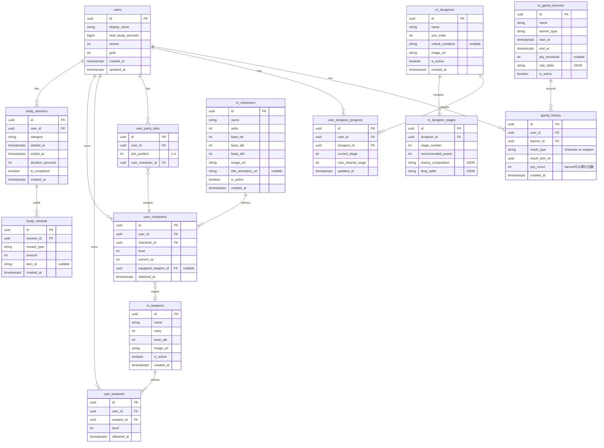

# データベーススキーマ設計 (Database Schema Design)

このドキュメントは、LevelUp Study アプリにおける全データ構造を定義する。
サーバーDB（PostgreSQL on Supabase）とローカルDB（KMP SQLDelight）の両方を対象とする。

---

## 1. 設計方針

### 1.1 データの正（Source of Truth）
| データ種別 | 正の所在 | 理由 |
|---|---|---|
| 通貨（石・ゴールド） | **サーバー** | 不正防止。クライアントで加算させない |
| 勉強セッション履歴 | **サーバー**（ローカルに未同期バッファ） | 統計・報酬計算の根拠 |
| 所持キャラ・武器 | **サーバー** | ガチャ結果はサーバー確定 |
| パーティ編成 | **サーバー** | チート防止（存在しないキャラを編成させない） |
| ダンジョン進行 | **サーバー** | 報酬整合性の担保 |
| ガチャ履歴・天井 | **サーバー** | 天井カウントの改ざん防止 |
| マスタデータ | **サーバー**（ローカルにキャッシュ） | アプリ更新なしでコンテンツ追加 |
| 未同期セッション | **ローカル専用** | オフライン勉強対応 |
| 設定値 | **ローカル専用** | ダークモード等、同期不要 |

### 1.2 オフライン同期フロー
```
[オフライン]
  勉強END → ローカル pending_study_sessions に保存
          → UI上は「仮の報酬」を表示（確定ではない旨を明示）

[オンライン復帰]
  pending_study_sessions を順次 POST /api/study/complete へ送信
  → サーバーが検証・報酬計算・DB反映
  → レスポンスの確定報酬でローカル表示を更新
  → pending から削除
```

### 1.3 命名規則
- サーバーテーブル: スネークケース（`user_characters`）
- マスタテーブル: `m_` プレフィックス（`m_characters`）
- ローカルテーブル: `local_` プレフィックス（`local_pending_sessions`）
- タイムスタンプ: すべて UTC、`TIMESTAMPTZ` 型

---

## 2. ER図（サーバーDB）



---

## 3. サーバーDB テーブル詳細

### 3.1 `users` — ユーザー基本情報

| カラム | 型 | NULL | Key | 説明 |
|---|---|---|---|---|
| `id` | `UUID` | No | PK | Supabase Auth の uid と一致させる |
| `display_name` | `VARCHAR(50)` | No | — | アプリ上の表示名 |
| `total_study_seconds` | `BIGINT` | No | — | 累計勉強秒数（サーバー計算の正値） |
| `stones` | `INT` | No | — | 知識の結晶（ガチャ通貨） |
| `gold` | `INT` | No | — | ゴールド（強化通貨） |
| `created_at` | `TIMESTAMPTZ` | No | — | アカウント作成日時 |
| `updated_at` | `TIMESTAMPTZ` | No | — | 最終更新日時 |

**デフォルト値:** `stones = 0`, `gold = 0`, `total_study_seconds = 0`

---

### 3.2 `study_sessions` — 勉強セッション

| カラム | 型 | NULL | Key | 説明 |
|---|---|---|---|---|
| `id` | `UUID` | No | PK | セッションID |
| `user_id` | `UUID` | No | FK → users | ユーザー |
| `category` | `VARCHAR(50)` | Yes | — | 勉強カテゴリ（英語, 数学 等） |
| `started_at` | `TIMESTAMPTZ` | No | — | 開始日時 |
| `ended_at` | `TIMESTAMPTZ` | No | — | 終了日時 |
| `duration_seconds` | `INT` | No | — | 実勉強秒数 |
| `is_completed` | `BOOLEAN` | No | — | ポモドーロの目標達成か |
| `created_at` | `TIMESTAMPTZ` | No | — | レコード作成日時 |

**インデックス:**
- `idx_study_sessions_user_id` ON `(user_id)`
- `idx_study_sessions_started_at` ON `(user_id, started_at)` — 統計クエリ用

---

### 3.3 `study_rewards` — セッション報酬明細

| カラム | 型 | NULL | Key | 説明 |
|---|---|---|---|---|
| `id` | `UUID` | No | PK | |
| `session_id` | `UUID` | No | FK → study_sessions | 対象セッション |
| `reward_type` | `VARCHAR(30)` | No | — | `stones` / `gold` / `xp` / `item_drop` |
| `amount` | `INT` | No | — | 獲得量 |
| `item_id` | `UUID` | Yes | — | ドロップアイテム時のマスタID |
| `created_at` | `TIMESTAMPTZ` | No | — | |

**補足:** 1セッションに対し複数行が入る（石 +5, ゴールド +10, XP +20 など）。ボーナス（30分連続 +10 石）も別行として記録する。

**インデックス:**
- `idx_study_rewards_session_id` ON `(session_id)`

---

### 3.4 `m_characters` — キャラクターマスタ

| カラム | 型 | NULL | Key | 説明 |
|---|---|---|---|---|
| `id` | `UUID` | No | PK | |
| `name` | `VARCHAR(100)` | No | — | キャラ名 |
| `rarity` | `INT` | No | — | 星1〜5 |
| `base_hp` | `INT` | No | — | 基本HP |
| `base_atk` | `INT` | No | — | 基本攻撃力 |
| `base_def` | `INT` | No | — | 基本防御力 |
| `image_url` | `TEXT` | No | — | 立ち絵URL |
| `idle_animation_url` | `TEXT` | Yes | — | ホーム画面用アニメーション |
| `is_active` | `BOOLEAN` | No | — | 有効フラグ（論理削除用） |
| `created_at` | `TIMESTAMPTZ` | No | — | |

---

### 3.5 `m_weapons` — 武器マスタ

| カラム | 型 | NULL | Key | 説明 |
|---|---|---|---|---|
| `id` | `UUID` | No | PK | |
| `name` | `VARCHAR(100)` | No | — | 武器名 |
| `rarity` | `INT` | No | — | 星1〜5 |
| `base_atk` | `INT` | No | — | 基本攻撃力 |
| `image_url` | `TEXT` | No | — | |
| `is_active` | `BOOLEAN` | No | — | |
| `created_at` | `TIMESTAMPTZ` | No | — | |

---

### 3.6 `m_dungeons` — ダンジョンマスタ

| カラム | 型 | NULL | Key | 説明 |
|---|---|---|---|---|
| `id` | `UUID` | No | PK | |
| `name` | `VARCHAR(100)` | No | — | ダンジョン名（「はじまりの森」等） |
| `sort_order` | `INT` | No | — | 表示順 |
| `unlock_condition` | `TEXT` | Yes | — | 解放条件（JSON or 式） |
| `image_url` | `TEXT` | No | — | |
| `is_active` | `BOOLEAN` | No | — | |
| `created_at` | `TIMESTAMPTZ` | No | — | |

---

### 3.7 `m_dungeon_stages` — ダンジョンステージマスタ

| カラム | 型 | NULL | Key | 説明 |
|---|---|---|---|---|
| `id` | `UUID` | No | PK | |
| `dungeon_id` | `UUID` | No | FK → m_dungeons | 所属ダンジョン |
| `stage_number` | `INT` | No | — | ステージ番号 |
| `recommended_power` | `INT` | No | — | 推奨戦力 |
| `enemy_composition` | `JSONB` | No | — | 敵の構成 `[{name, hp, atk}]` |
| `drop_table` | `JSONB` | No | — | ドロップテーブル `[{item_id, rate}]` |

**インデックス:**
- `idx_dungeon_stages_dungeon_id` ON `(dungeon_id, stage_number)`

---

### 3.8 `m_gacha_banners` — ガチャバナーマスタ

| カラム | 型 | NULL | Key | 説明 |
|---|---|---|---|---|
| `id` | `UUID` | No | PK | |
| `name` | `VARCHAR(100)` | No | — | バナー名 |
| `banner_type` | `VARCHAR(30)` | No | — | `character` / `weapon` / `mixed` |
| `start_at` | `TIMESTAMPTZ` | No | — | 開始日時 |
| `end_at` | `TIMESTAMPTZ` | No | — | 終了日時 |
| `pity_threshold` | `INT` | Yes | — | 天井回数（nullなら天井なし） |
| `rate_table` | `JSONB` | No | — | 排出確率 `[{item_id, rarity, rate}]` |
| `is_active` | `BOOLEAN` | No | — | |

---

### 3.9 `user_characters` — ユーザー所持キャラ

| カラム | 型 | NULL | Key | 説明 |
|---|---|---|---|---|
| `id` | `UUID` | No | PK | |
| `user_id` | `UUID` | No | FK → users | |
| `character_id` | `UUID` | No | FK → m_characters | |
| `level` | `INT` | No | — | 現在レベル |
| `current_xp` | `INT` | No | — | 現在の累積経験値 |
| `equipped_weapon_id` | `UUID` | Yes | FK → user_weapons | 装備中の武器（null = なし） |
| `obtained_at` | `TIMESTAMPTZ` | No | — | 入手日時 |

**デフォルト値:** `level = 1`, `current_xp = 0`

**インデックス:**
- `idx_user_characters_user_id` ON `(user_id)`
- `idx_user_characters_unique` UNIQUE ON `(user_id, character_id)` — 同キャラ重複なし（重ね仕様がある場合は除去）

---

### 3.10 `user_weapons` — ユーザー所持武器

| カラム | 型 | NULL | Key | 説明 |
|---|---|---|---|---|
| `id` | `UUID` | No | PK | |
| `user_id` | `UUID` | No | FK → users | |
| `weapon_id` | `UUID` | No | FK → m_weapons | |
| `level` | `INT` | No | — | 武器レベル |
| `obtained_at` | `TIMESTAMPTZ` | No | — | |

**デフォルト値:** `level = 1`

**インデックス:**
- `idx_user_weapons_user_id` ON `(user_id)`

---

### 3.11 `user_party_slots` — パーティ編成

| カラム | 型 | NULL | Key | 説明 |
|---|---|---|---|---|
| `id` | `UUID` | No | PK | |
| `user_id` | `UUID` | No | FK → users | |
| `slot_position` | `INT` | No | — | 1〜4 |
| `user_character_id` | `UUID` | No | FK → user_characters | 配置キャラ |

**制約:**
- UNIQUE `(user_id, slot_position)` — 1スロットに1キャラ
- UNIQUE `(user_id, user_character_id)` — 同キャラ二重編成防止

---

### 3.12 `user_dungeon_progress` — ダンジョン進行状況

| カラム | 型 | NULL | Key | 説明 |
|---|---|---|---|---|
| `id` | `UUID` | No | PK | |
| `user_id` | `UUID` | No | FK → users | |
| `dungeon_id` | `UUID` | No | FK → m_dungeons | |
| `current_stage` | `INT` | No | — | 現在挑戦中のステージ |
| `max_cleared_stage` | `INT` | No | — | 最高クリア済みステージ |
| `updated_at` | `TIMESTAMPTZ` | No | — | |

**制約:**
- UNIQUE `(user_id, dungeon_id)` — ダンジョンごとに1レコード

---

### 3.13 `gacha_history` — ガチャ履歴

| カラム | 型 | NULL | Key | 説明 |
|---|---|---|---|---|
| `id` | `UUID` | No | PK | |
| `user_id` | `UUID` | No | FK → users | |
| `banner_id` | `UUID` | No | FK → m_gacha_banners | |
| `result_type` | `VARCHAR(20)` | No | — | `character` / `weapon` |
| `result_item_id` | `UUID` | No | — | 排出されたマスタID |
| `pity_count` | `INT` | No | — | このバナー内での累計回数 |
| `created_at` | `TIMESTAMPTZ` | No | — | |

**インデックス:**
- `idx_gacha_history_user_banner` ON `(user_id, banner_id)` — 天井カウント取得用

---

## 4. ローカルDB（KMP SQLDelight）

### 4.1 `local_pending_sessions` — 未同期の勉強セッション

| カラム | 型 | 説明 |
|---|---|---|
| `id` | `TEXT (UUID)` | クライアント生成のUUID |
| `category` | `TEXT` | 勉強カテゴリ |
| `started_at` | `INTEGER (epoch ms)` | 開始日時 |
| `ended_at` | `INTEGER (epoch ms)` | 終了日時 |
| `duration_seconds` | `INTEGER` | 勉強秒数 |
| `is_completed` | `INTEGER (0/1)` | ポモドーロ達成フラグ |
| `sync_status` | `TEXT` | `pending` / `syncing` / `failed` |
| `retry_count` | `INTEGER` | 送信リトライ回数 |
| `created_at` | `INTEGER (epoch ms)` | レコード作成日時 |

**補足:** オンライン復帰時に `sync_status = pending` のレコードを古い順に送信。3回失敗したら `failed` にしてユーザーに通知。

---

### 4.2 `local_master_cache` — マスタデータキャッシュ

| カラム | 型 | 説明 |
|---|---|---|
| `key` | `TEXT` | キャッシュキー（`characters`, `weapons`, `dungeons` 等） |
| `data` | `TEXT (JSON)` | マスタデータ本体 |
| `etag` | `TEXT` | サーバーの ETag（差分取得用） |
| `fetched_at` | `INTEGER (epoch ms)` | 取得日時 |

**補足:** 起動時に `fetched_at` が古ければ再取得。`If-None-Match` ヘッダーで差分チェック。

---

### 4.3 `local_user_snapshot` — ユーザー情報のローカルキャッシュ

| カラム | 型 | 説明 |
|---|---|---|
| `user_id` | `TEXT (UUID)` | ユーザーID |
| `display_name` | `TEXT` | 表示名 |
| `total_study_seconds` | `INTEGER` | 累計勉強秒数（最終同期時点） |
| `stones` | `INTEGER` | 石（最終同期時点） |
| `gold` | `INTEGER` | ゴールド（最終同期時点） |
| `updated_at` | `INTEGER (epoch ms)` | 最終同期日時 |

**補足:** 起動直後はこのスナップショットで画面を描画し、バックグラウンドでサーバーから最新値をfetchして上書きする。

---

## 5. 報酬計算ロジック（サーバー側 参考）

勉強セッション完了時に、サーバーは以下を計算して `study_rewards` に書き込む。

### 5.1 ガチャ石（知識の結晶）
| 条件 | 獲得量 | reward_type |
|---|---|---|
| 10分ごと | +5 | `stones` |
| 30分連続達成 | +10（ボーナス） | `stones_bonus_30` |
| 60分連続達成 | +25（ボーナス） | `stones_bonus_60` |
| 1日累計2時間達成 | +50（日次ボーナス） | `stones_bonus_daily` |

### 5.2 ゴールド・経験値
サーバーが `user_dungeon_progress` の現在ステージと `m_dungeon_stages.drop_table` を参照し、勉強時間に応じたバトル回数分の報酬を算出する。

### 5.3 処理の流れ
```
POST /api/study/complete
  1. リクエスト検証（duration が妥当か、started_at が未来でないか 等）
  2. study_sessions INSERT
  3. 報酬計算 → study_rewards INSERT（複数行）
  4. users.stones += 計算値, users.gold += 計算値, users.total_study_seconds += duration
  5. user_characters の XP 加算（パーティメンバー）
  6. user_dungeon_progress の stage 進行
  7. トランザクション COMMIT
  8. レスポンス返却 { session_id, rewards[], updated_user{stones, gold, total_study_seconds} }
```

---

## 6. DELETE ポリシー

| テーブル | ユーザー削除時 |
|---|---|
| `study_sessions` | CASCADE |
| `study_rewards` | CASCADE（session経由） |
| `user_characters` | CASCADE |
| `user_weapons` | CASCADE |
| `user_party_slots` | CASCADE |
| `user_dungeon_progress` | CASCADE |
| `gacha_history` | CASCADE |
| `m_*` テーブル | 影響なし（マスタは残る） |

---

*最終更新日: 2026-03-31*
