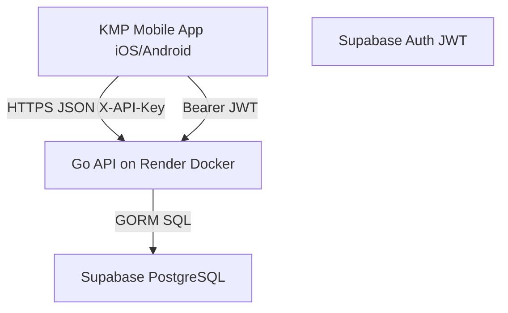

# バックエンド設計指針 (Backend Architecture)

このドキュメントでは、アプリの拡張性（新キャラ/新ダンジョンの追加、データ永続化、チート防止）を考慮したバックエンド構成をまとめます。

**最終更新:** 2026-06-04

---

## アーキテクチャ構成



### 1. インフラ構成 (Tech Stack)

| レイヤ | 技術 | 備考 |
|--------|------|------|
| **API Server** | **Go** + **chi** on **Render**（Docker Web Service） | 常駐プロセス。無料枠はスリープあり。[`backend/RENDER.md`](../../backend/RENDER.md) 参照 |
| **Database** | **PostgreSQL** on **Supabase** | `DATABASE_URL`（Session pooler 推奨） |
| **Auth** | **Supabase Auth** + JWT | `JWT_SECRET` で検証。`OwnerGuard` で userID 一致 |
| **Client 識別** | `X-API-Key` ヘッダ | 全 `/api/v1/*` に適用（`DEV_MODE` 時スキップ） |

> **注:** 初期設計では Vercel Serverless を想定していたが、現行は **Render + Docker** で運用している（[`render.yaml`](../../render.yaml)）。

### 2. リポジトリ構成

```
backend/
├── cmd/api/main.go          # エントリーポイント
├── internal/
│   ├── handler/             # HTTP ハンドラー
│   ├── service/             # ビジネスロジック（study, gacha）
│   ├── repository/          # GORM データアクセス
│   ├── middleware/          # JWT, API Key, CORS, RateLimit
│   └── router/router.go     # ルート定義（正本）
├── db/migrations/           # golang-migrate（baseline）
├── db/seed.sql              # マスタ・開発用 seed
├── api/openapi.yaml         # OpenAPI 3.0 API contract
└── Dockerfile               # Render ビルド用
```

OpenAPI 定義: [`backend/api/openapi.yaml`](../../backend/api/openapi.yaml)

---

## API エンドポイント一覧

ベース URL（本番）: `https://levelup-study-api.onrender.com`

認証凡例: 🔓 不要 / 🔑 API Key のみ / 🔐 API Key + JWT（`/users/{userID}` 配下は Owner Guard も適用）

| メソッド | パス | 認証 | 説明 |
|---------|------|------|------|
| `GET` | `/` | 🔓 | ヘルスチェック |
| `POST` | `/api/v1/users` | 🔑 | ユーザー作成 |
| `GET/PUT/DELETE` | `/api/v1/users/{userID}` | 🔐 | ユーザー CRUD |
| `POST` | `/api/v1/debug/users/{userID}/currencies` | 🔐 | DEV_MODE のみ: 通貨デバッグ |
| `POST` | `/api/v1/users/{userID}/study/complete` | 🔐 | 勉強完了・報酬確定 |
| `GET` | `/api/v1/users/{userID}/study/sessions` | 🔐 | 勉強履歴一覧 |
| `GET` | `/api/v1/users/{userID}/characters` | 🔐 | 所持キャラ一覧 |
| `GET` | `/api/v1/users/{userID}/characters/{characterID}` | 🔐 | 所持キャラ詳細 |
| `PUT` | `/api/v1/users/{userID}/characters/{characterID}/equip` | 🔐 | 武器装備 |
| `POST` | `/api/v1/users/{userID}/characters/{characterID}/level-up` | 🔐 | キャラ LvUP |
| `GET` | `/api/v1/users/{userID}/weapons` | 🔐 | 所持武器一覧 |
| `POST` | `/api/v1/users/{userID}/weapons/{weaponID}/level-up` | 🔐 | 武器 LvUP |
| `GET` | `/api/v1/users/{userID}/party` | 🔐 | パーティ取得 |
| `PUT/DELETE` | `/api/v1/users/{userID}/party/{slotPosition}` | 🔐 | スロット更新・解除 |
| `GET` | `/api/v1/users/{userID}/dungeons` | 🔐 | ダンジョン進行 |
| `POST` | `/api/v1/users/{userID}/gacha/pull` | 🔐 | ガチャ実行 |
| `GET` | `/api/v1/users/{userID}/gacha/history` | 🔐 | ガチャ履歴 |
| `GET` | `/api/v1/master/characters` | 🔑 | キャラマスタ |
| `GET` | `/api/v1/master/weapons` | 🔑 | 武器マスタ |
| `GET` | `/api/v1/master/dungeons` | 🔑 | ダンジョンマスタ |
| `GET` | `/api/v1/master/dungeons/{dungeonID}` | 🔑 | ダンジョン詳細（ステージ・敵） |
| `GET` | `/api/v1/master/gacha/banners` | 🔑 | 開催中ガチャバナー |
| `GET` | `/api/v1/master/genres` | 🔑 | 勉強ジャンルマスタ |
| `POST` | `/api/v1/master/genres` | 🔐 | ジャンル追加 |
| `DELETE` | `/api/v1/master/genres/{genreID}` | 🔐 | ジャンル論理削除 |

ルート定義の正本: [`backend/internal/router/router.go`](../../backend/internal/router/router.go)
API 契約: [`backend/api/openapi.yaml`](../../backend/api/openapi.yaml)

---

## データ同期戦略

### 1. 同期対象データ（サーバーが正）

| データ | 理由 |
|--------|------|
| 通貨（石・ゴールド） | 不正防止 |
| 所持キャラ・武器 | ガチャ結果はサーバー確定 |
| パーティ編成 | 存在しないキャラの編成防止 |
| 勉強セッション履歴 | 統計・報酬計算の根拠 |
| ダンジョン進行 | 報酬整合性 |
| ガチャ天井・履歴 | 改ざん防止 |

### 2. 勉強完了フロー

```
モバイル: 勉強 END
  → POST /api/v1/users/{id}/study/complete
  → サーバー: 報酬計算・DB 反映・レスポンス
  → オフライン時: pending キュー → 復帰後に順次 POST
```

詳細スキーマ: [`docs/database/01_Database_Schema.md`](../database/01_Database_Schema.md)

---

## コンテンツ更新性 (Content Delivery)

- **マスタデータ API** — キャラ・武器・ダンジョン・ガチャバナーを `/api/v1/master/*` で配信。アプリ更新なしでコンテンツ追加可能。
- **マスタ画像 CDN** — Supabase Storage 経由（計画中、Issue #25）。

---

## デプロイ・CI

| 項目 | 内容 |
|------|------|
| デプロイ | Render Blueprint（`main` push + `backend/**` 変更） |
| CI | `.github/workflows/backend-ci.yml` — `go test` + `go vet` |
| ローカル | `backend/Makefile` — `make run`, `make test`, `make seed` |

手順詳細: [`backend/RENDER.md`](../../backend/RENDER.md)

---

## 関連ドキュメント

- ロードマップ: [`01_Features_and_Roadmap.md`](01_Features_and_Roadmap.md)
- 全体アーキテクチャ: [`docs/architecture/01_Overview.md`](../architecture/01_Overview.md)
- DB スキーマ: [`docs/database/01_Database_Schema.md`](../database/01_Database_Schema.md)
