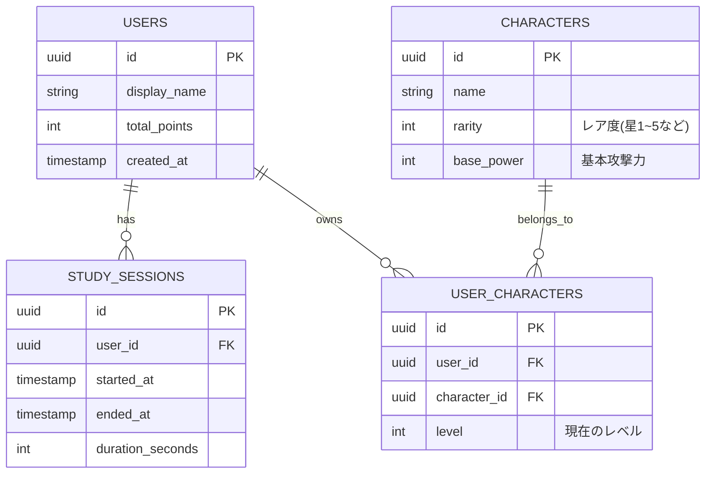

# データベーススキーマ定義フォーマット (DB Schema Template)

このフォーマットは、バックエンド（Go / PostgreSQL）側、もしくはクライアントのローカルDB（KMP / SQLDelight等）のデータ構造・テーブル定義を設計するためのものです。

---

## 1. エンティティ概要 (Entity Overview)
- **テーブル名:** `users` / `characters` / `study_sessions` など
- **役割:** 
  - [例: ユーザーの基本情報と、所持しているガチャポイントを管理する]

## 2. ER図 (Entity-Relationship Diagram)
Mermaid構文を使って、テーブル間のリレーションシップを可視化します。

## 3. カラム詳細定義 (Columns detail)

### テーブル: `users`
| カラム名 (Column) | データ型 (Type) | NULL | キー (Key) | 説明 (Description) |
|---|---|---|---|---|
| `id` | `UUID` | No | PK | ユーザーの一意識別子 |
| `display_name` | `VARCHAR(50)` | No | - | アプリ上の表示名 |
| `total_points` | `INT` | No | - | 現在所持しているガチャ用のポイント |
| `created_at` | `TIMESTAMP` | No | - | アカウント作成日時 |

## 4. 備考・インデックス要件 (Notes & Indexes)
- `user_id` 列には検索を高速化するためのインデックス (`idx_study_session_user_id`) を貼ること。
- ユーザー削除時 (`DELETE ON CASCADE`) の挙動についての特記事項など。
